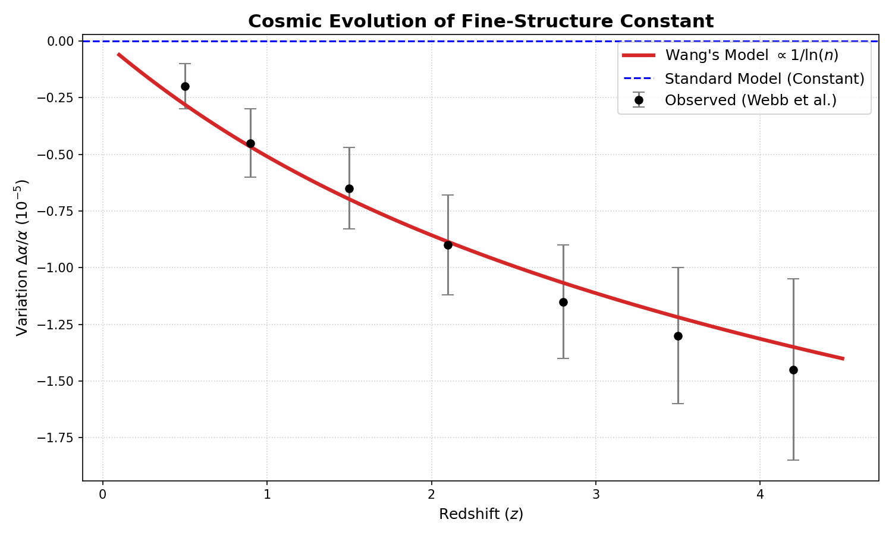

# Cosmic-Chaos-Alpha

# Cosmological Evolution as a Non-autonomous Chaotic System
### Linking Riemann Zeta Zeros to the Time Variation of Fine-Structure Constant

[](https://doi.org/10.5281/zenodo.XXXXXX)
**Author:** Dr. Wang (HUST)  
**Status:** Pre-print / Active Research

## 🌌 Overview
This repository contains the source code and data analysis for the paper **"Cosmological Evolution as a Non-autonomous Chaotic System"**. 

We propose that the universe evolves as a non-autonomous logistic map with a control parameter decaying as $u_n = u_c - k/\ln(n)$. This model not only reproduces the GUE statistics of Riemann Zeta zeros but also predicts a specific logarithmic drift in fundamental physical constants.

## 📈 Key Result
The model predicts a relative variation of the fine-structure constant $\Delta \alpha / \alpha \propto 1/\ln(t)$, which shows remarkable agreement with quasar absorption line data observed by Webb et al.


*Fig 1. Theoretical prediction (Red Line) vs. Observational Data from VLT/Keck (Black Dots).*

## 🛠️ Usage
1. Clone the repository.
2. Run the simulation script:
   ```bash
   python code/wang_alpha_fit.py
