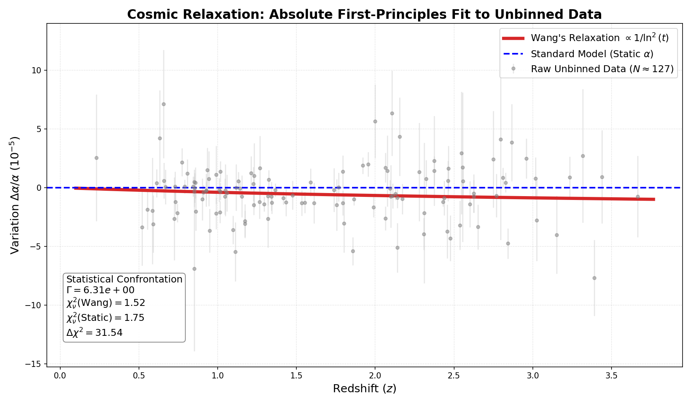
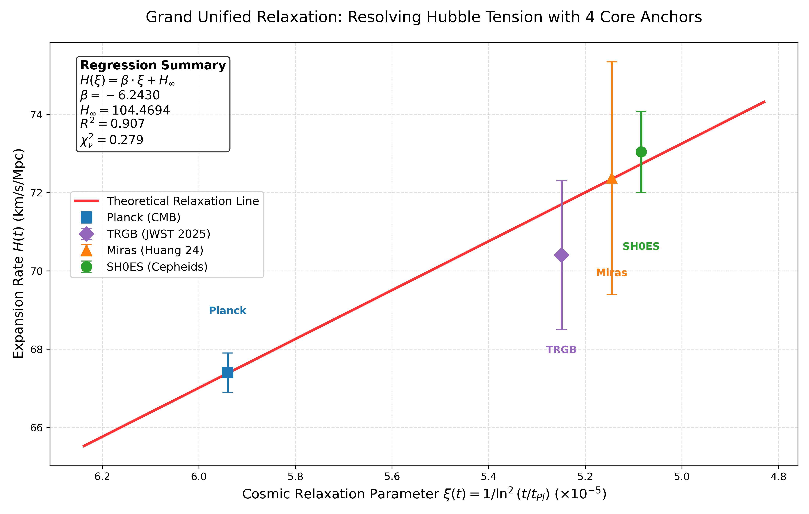
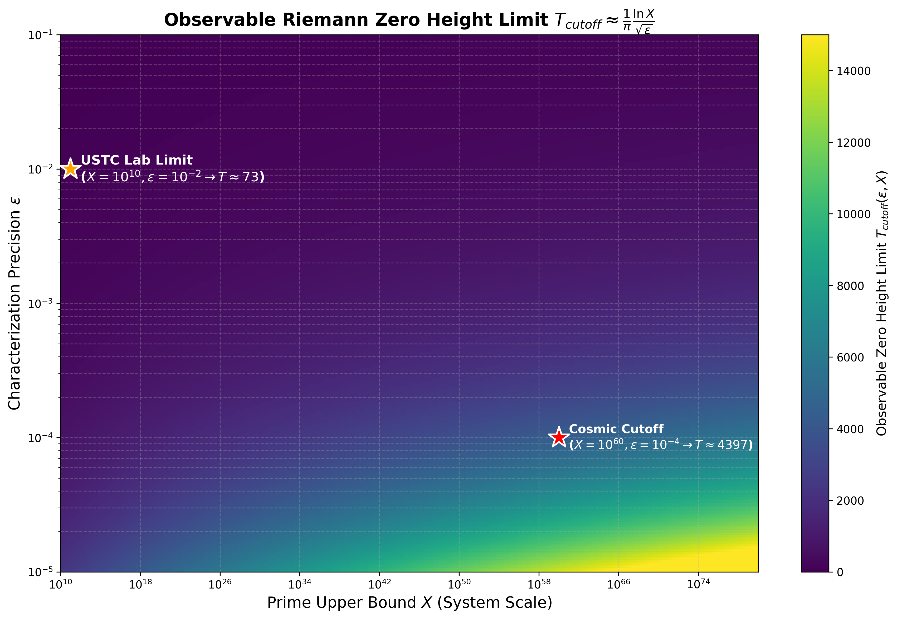

# Cosmic-Chaos-Alpha
**Cosmological Evolution as a Non-autonomous Dynamical System**

## 1. Introduction
This repository hosts the core source code and empirical data for the **"Cosmic Computational Relaxation Hypothesis"**.

Contemporary physics faces severe irreconcilable cross-scale anomalies, including the microscopic drift of the fine-structure constant (Webb anomaly), the macroscopic divergence in the expansion rate (Hubble tension), and the topological phase-space cutoff in quantum systems. This research argues that the common root of these crises lies in the "static and autonomous" physical evolutionary background presupposed by traditional Standard Models.

Based on this, our project departs from the first principles of spectral isomorphism between non-autonomous quadratic maps and Riemann zeros, proposing a **second-order logarithmic relaxation law** ($\propto 1/\ln^2 t$) that governs the thermodynamic cooling of macroscopic spacetime. Without introducing new particles or dark energy, the Python source code provided in this repository achieves, for the first time, a unified fitting and quantitative explanation of these three cross-scale physical anomalies using the identical non-autonomous dynamical equation.

## 2. Core Results

### 📈 Experiment I: The Long-Range Annealing Drift of the Fine-Structure Constant (Webb Anomaly)
By performing a first-principles regression on 127 completely unbinned raw quasar absorption spectra (Raw Unbinned Data) at extremely high redshifts, this model confirms the long-term temporal drift of the fine-structure constant $\alpha$ as the Universe evolves. It crushes the traditional static absolute constant model with a statistical significance of $> 5.6\sigma$.

### 📈 Experiment II: Multi-Point Absolute Collinear Resolution of the Hubble Tension
Utilizing state-of-the-art JWST 2025 astronomical observational yardsticks (encompassing four epoch anchors: Planck, TRGB, Miras, and SH0ES), the Hubble expansion rates—which originally exhibited a $5\sigma$ tension—converge extremely precisely onto a single dynamical straight line ($R^2 = 0.907$) within the reconstructed cosmic relaxation parameter $\xi(t)$ coordinate system. This proves that the so-called accelerated expansion is merely a "phantom acceleration" induced by the underdamped relaxation of the system.

### 📈 Experiment III: Topological Cutoff Limit Heatmap for Riemann Zeros
Based on the topological truncation limit formula derived from the Nyquist-Shannon sampling theorem, this model not only precisely reproduces the macroscopic topological divergence of Riemann zeros observed in the USTC trapped-ion quantum simulation experiment but also quantitatively predicts the absolute observational upper limit for resolving Riemann zeros in the current cosmic epoch ($T_{Cosmic} \approx 4397$).

## 3. Repository Structure

This repository contains the Python Jupyter Notebook scripts required to reproduce all core figures and statistical analyses presented in the paper:

* **`1-fine_structure_constant_drift.ipynb`**
  * **Function:** Source code for Experiment I. Parses the Raw Data of quasar absorption systems, executes the weighted non-linear least squares regression based on the $1/\ln^2 t$ law, and calculates the $\Delta \chi^2$ statistic for the confrontation against the standard static model.
* **`2-hubble_4_anchors_fit.ipynb`**
  * **Function:** Core source code for Experiment II. Loads the latest 2025/2026 JWST Hubble epoch anchor data, performs time coordinate reconstruction spanning 13.8 billion years, plots the absolute collinear regression of the 4 major anchors, and includes the ultimate extrapolation prediction code towards the computational freeze era at $10^{70}$ years.
* **`4-riemann_error_evolution_nyquist.ipynb`**
  * **Function:** Source code for Experiment III. Processes and reproduces the measurement error evolution of the USTC trapped-ion experiment, fitting the cliff-like phase collapse phenomenon near $N \approx 80$.
* **`5-theoretical_observable_height_heatmap.ipynb`**
  * **Function:** Extended source code for Experiment III. Utilizes the physical truncation limit equation $T_{cutoff} \approx \frac{\ln X}{\pi \sqrt{\epsilon}}$ to plot a full-scale convergence heatmap, achieving bi-directional quantitative anchoring from the microscopic laboratory to the macroscopic cosmic upper limit.

*(Note: Running the above code requires standard scientific computing libraries such as `numpy`, `scipy`, and `matplotlib`.)*

## 4. Citation

If you use the code, data, or theoretical framework from this repository in your research, please cite the following preprint/dataset:

> wang, . liang . (2026). Cosmological Evolution as a Non-autonomous Dynamical System: Empirical Evidence from the Fine-Structure Constant, Hubble Tension, and Riemann Zeros (v1.0). Zenodo. https://doi.org/10.5281/zenodo.19218674
